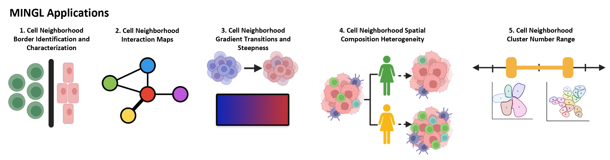

## MINGL: Quantifies Borders, Gradients, and Heterogeneity in Multicellular Tissue Organization

**Kyra Van Batavia¹, James Wright²˒³, Annette Chen¹, Yuexi Li¹, John W. Hickey¹\***

¹ Department of Biomedical Engineering, Duke University, Durham, NC, USA  
² Department of Computer Science, Duke University, Durham, NC, USA  
³ Department of Mathematics, Duke University, Durham, NC, USA  

\* **Corresponding author:** john.hickey@duke.edu  
**Contributing authors:** kyra.vanbatavia@duke.edu; james.wright@duke.edu; annette.chen@duke.edu; yuexi.li@duke.edu  

---

## Abstract

Tissues are organized with interacting multicellular organizational units whose interfaces and transitions shape function in health and disease. Current spatial-omics analyses typically assign cells to a single cellular neighborhood—ignoring natural gradients, heterogeneity, and borders.  

Here we present **MINGL** (*Mixture-based Identification of Neighborhood Gradients with Likelihood estimates*), a probabilistic framework that converts existing neighborhood annotations into continuous measures of tissue architecture.  

MINGL models each cell by multi-membership probabilities across hierarchical organizational units and uses these probabilities to identify enriched cells at interfaces between units, constructs interaction networks across hierarchical scales, quantifies compositional gradient transitions, measures context-specific composition heterogeneity, and provides a starting point for neighborhood resolution. Across multiple spatial-omic datasets spanning melanoma, healthy intestine, and Barrett’s Esophagus progression, MINGL detected innate immune-enriched interfaces at tumor and anatomical interfaces, plasma cell niches linking cellular neighborhoods, distinct regimes of sharp and gradual transitions between organizational states, and disease-associated neighborhood remodeling. By treating neighborhood assignment uncertainty as a biological signal rather than noise, MINGL unifies discrete and continuous representations of tissue organization and makes tissue architecture measurable, comparable, and scalable across biological scales and spatial-omics platforms.

---

## MINGL Applications



---

## Getting Started

MINGL is a set of tools and plotting functions for identifying and quantifying borders between hierarchical units and gradients of changing cellular organization across these interfaces. MINGL is also a tool for investigating heterogeneity in hierarchical tissue organization across disease states, between patients, or across tissue samples from the same patient, and can identify changes in cellular organization even when anchor cell types remain unchanged.
MINGL also includes a tool for suggesting a biologically-informed cluster number range as a starting point for hierarchical spatial organization analysis.

MINGL's main tool can be run on MacOS or WindowsOS using CPU, and is also equipped with a GPU accelerated version compatible with cupy and WindowsOS as of version 0.0.1.

Please see instructions on installation and our recommended use below. Happy exploration of "life on the edge" in borders between spatial organization of our tissues!

## Installation

Python 3.11 or newer is required for installation on your system.

We recommend that you install MINGL into a new, fresh environment to avoid any dependency conflicts. First, create your new environment using Python version 3.11 and follow either of the installation methods below.

There are two options to install MINGL:

<!--
1) Install the latest release of `MINGL` from [PyPI][]:

```bash
pip install MINGLE
```
-->

1. Install the latest development version:

```bash
pip install git+https://github.com/HickeyLab/Mingl.git@main
```

## Release Notes

See the [changelog][].

## Contact

For questions and help requests, you can reach out to the authors.
If you found a bug, please use the [issue tracker][].

## Citation

> t.b.a

[uv]: https://github.com/astral-sh/uv
[scverse discourse]: https://discourse.scverse.org/
[issue tracker]: https://github.com/jwrightd/MINGLE/issues
[tests]: https://github.com/jwrightd/MINGLE/actions/workflows/test.yaml
[documentation]: https://MINGLE.readthedocs.io
[changelog]: https://MINGLE.readthedocs.io/en/latest/changelog.html
[api documentation]: https://MINGLE.readthedocs.io/en/latest/api.html
[pypi]: https://pypi.org/project/MINGLE

### Repository Structure
Mingl/
├── src/
│   └── mingl/
│       ├── pl/                      # Plotting functions
│       │   ├── cell_composition.py
│       │   ├── cnd.py
│       │   ├── dpp.py
│       │   ├── dv.py
│       │   ├── edges_pp.py
│       │   ├── enrichment.py
│       │   ├── gmm_plots.py
│       │   ├── gvs.py
│       │   ├── plt_dv.py
│       │   ├── rnd.py
│       │   ├── spatial_location_reg.py
│       │   ├── spatial_probability_map.py
│       │   └── violin.py
│       ├── pp/                      # Preprocessing tools
│       │   └── preprocessing.py
│       ├── tl/                      # Core analysis tools
│       │   ├── ccd.py
│       │   ├── centroids.py
│       │   ├── compute_proportions.py
│       │   ├── crd.py
│       │   ├── edges.py
│       │   ├── gb.py
│       │   ├── gmm.py
│       │   ├── gmm_gpu.py
│       │   ├── grad.py
│       │   ├── gvs2.py
│       │   ├── knn.py
│       │   ├── knn2.py
│       │   ├── n_neighbors.py
│       │   ├── network_graphs.py
│       │   ├── testgvs.py
│       │   └── utils_adata.py
│       └── __init__.py
├── tutorials/                       # Example notebooks
│   ├── fig2_intestine_neighborhood.ipynb
│   ├── fig2_intestine_tissueunit.ipynb
│   ├── fig2_melanoma_neighborhood.ipynb
│   ├── fig3_networks.ipynb
│   ├── fig4_intestine_neighborhood.ipynb
│   ├── fig4_intestine_community.ipynb
│   ├── fig5_esophagus.ipynb
│   └── fig6_intestine_n_neighborhoods.ipynb
├── tools/                           # Utility scripts
│   ├── enrich_tutorial_annotations.py
│   └── ...
├── tests/                           # Unit tests
├── docs/                            # Images and docs
├── README.md
└── pyproject.toml

