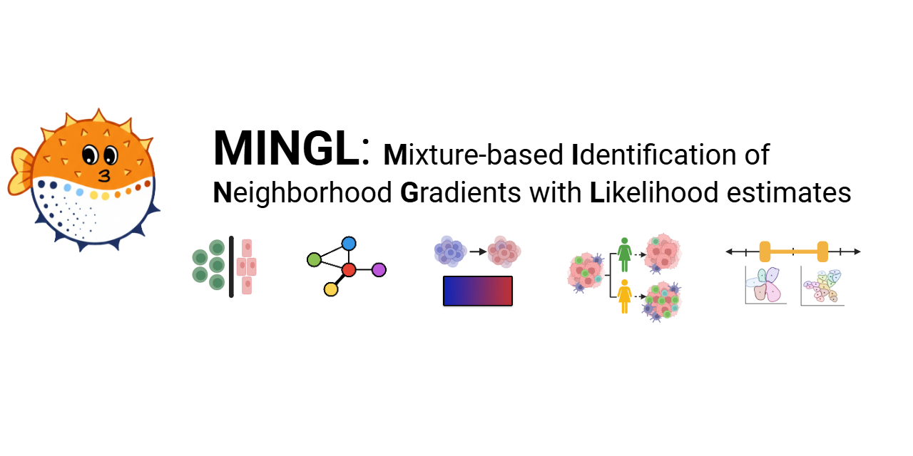

## MINGL: Quantifies Borders, Gradients, and Heterogeneity in Multicellular Tissue Organization

**Kyra Van Batavia¹, James Wright²˒³, Annette Chen¹, Yuexi Li¹, John W. Hickey¹\***

¹ Department of Biomedical Engineering, Duke University, Durham, NC, USA  
² Department of Computer Science, Duke University, Durham, NC, USA  
³ Department of Mathematics, Duke University, Durham, NC, USA  

\* **Corresponding author:** john.hickey@duke.edu  
**Contributing authors:** kyra.vanbatavia@duke.edu; james.wright@duke.edu; annette.chen@duke.edu; yuexi.li@duke.edu  

**Preprint:** https://www.biorxiv.org/content/10.64898/2026.03.24.713296v1

---



## Abstract

Tissues are organized with interacting multicellular organizational units whose interfaces and transitions shape function in health and disease. Current spatial-omics analyses typically assign cells to a single cellular neighborhood—ignoring natural gradients, heterogeneity, and borders.  

Here we present **MINGL** (*Mixture-based Identification of Neighborhood Gradients with Likelihood estimates*), a probabilistic framework that converts existing neighborhood annotations into continuous measures of tissue architecture.  

MINGL models each cell by multi-membership probabilities across hierarchical organizational units and uses these probabilities to identify enriched cells at interfaces between units, constructs interaction networks across hierarchical scales, quantifies compositional gradient transitions, measures context-specific composition heterogeneity, and provides a starting point for neighborhood resolution. Across multiple spatial-omic datasets spanning melanoma, healthy intestine, and Barrett’s Esophagus progression, MINGL detected innate immune-enriched interfaces at tumor and anatomical interfaces, plasma cell niches linking cellular neighborhoods, distinct regimes of sharp and gradual transitions between organizational states, and disease-associated neighborhood remodeling. By treating neighborhood assignment uncertainty as a biological signal rather than noise, MINGL unifies discrete and continuous representations of tissue organization and makes tissue architecture measurable, comparable, and scalable across biological scales and spatial-omics platforms.

---

## MINGL Applications


---

## Getting Started

MINGL is a set of tools and plotting functions for identifying and quantifying borders between hierarchical units and gradients of changing cellular organization across these interfaces. MINGL is also a tool for investigating heterogeneity in hierarchical tissue organization across disease states, between patients, or across tissue samples from the same patient, and can identify changes in cellular organization even when anchor cell types remain unchanged.
MINGL also includes a tool for suggesting a biologically-informed cluster number range as a starting point for hierarchical spatial organization analysis.

MINGL's main tool can be run on MacOS or WindowsOS using CPU, and is also equipped with a GPU accelerated version compatible with cupy and WindowsOS as of version 0.0.1. General CPU GMM tool calculations on an average system can take several hours, and scales with number of cells and spatial organization categories. All other tools take less than several minutes to run.

Please see instructions on installation and our recommended use below. Happy exploration of "life on the edge" in borders between spatial organization of our tissues!

## Installation

Python 3.11 or newer is required for installation on your system.

We recommend that you install MINGL into a new, fresh environment to avoid any dependency conflicts. First, create your new environment using Python version 3.11 and follow either of the installation methods below. Installation time on MacOS and WindowsOS takes approximately less than 5 minutes.

There are two options to install MINGL:

1. Install the latest release from [PyPI][]:

```bash
pip install mingle-hl
```

Import the library in Python with:

```python
import mingl as mg
```

2. Install the latest development version:

```bash
pip install git+https://github.com/HickeyLab/Mingl.git@main
```
Dependencies required are as follows: "anndata>=0.10,<0.13", "numpy>=1.26,<3", "pandas>=2.2,<3.0", "scipy>=1.12,<2", "scikit-learn>=1.4,<2", "matplotlib>=3.8,<4", "seaborn>=0.13,<0.14", "networkx>=3.2,<4", "tqdm>=4.66,<5", "session-info2"

## Release Notes

See the [changelog][].

## Contact

For questions and help requests, you can reach out to the authors.
If you found a bug, please use the [issue tracker][].

## Citation

> t.b.a

[uv]: https://github.com/astral-sh/uv
[scverse discourse]: https://discourse.scverse.org/
[issue tracker]: https://github.com/HickeyLab/Mingl/issues
[tests]: https://github.com/HickeyLab/Mingl/actions/workflows/test.yaml
[documentation]: https://mingl.readthedocs.io
[changelog]: https://mingl.readthedocs.io/en/latest/changelog.html
[api documentation]: https://mingl.readthedocs.io/en/latest/api.html
[pypi]: https://pypi.org/project/mingle-hl

### Repository Structure
```text
Mingl/
├── src/
│   └── mingl/
│       ├── pl/                                # Plotting functions
│       │   ├── cell_composition.py            # Cell type distributions throughout transition gradient
│       │   ├── cnd.py                         # Compute delta values and plot spatial heterogeneity of groups
│       │   ├── dpp.py                         # Summed and average delta values per patient
│       │   ├── dv.py                          # Delta volcano plots of cell type enrichment/depletion in specific organization and groups
│       │   ├── edges_pp.py                    # Positive neighborhood probability and count above threshold distributions
│       │   ├── enrichment.py                  # Enrichment of cell types at transition border between two organizational units
│       │   ├── gmm_plots.py                   # Catplot of region colored by assigned organizational classification
│       │   ├── gvs.py                         # Cell type proportion heterogeneity across groups compared to global
│       │   ├── plt_dv.py                      # Log2 fold abundance of cell types in one group compared to global
│       │   ├── rnd.py                         # Region-specific delta values of spatial organization heterogeneity
│       │   ├── spatial_location_reg.py        # Show border cells in relation to singly positive organizational unit cells
│       │   ├── spatial_probability_map.py     # Catplot of region colored by MINGL probability 
│       │   └── violin.py                      # Transition gradient clusters' probability ratio score distributions
│       ├── pp/                                # Preprocessing tools
│       │   └── preprocessing.py
│       ├── tl/                                # Core analysis tools
│       │   ├── ccd.py                         # Compute condition or group specific delta values
│       │   ├── centroids.py                   # Calculate centroids of lower level labels at your desired hierarchical organization level
│       │   ├── compute_proportions.py         # Compute cell type proportions of different groups/conditions
│       │   ├── crd.py                         # Compute tissue region specific delta values
│       │   ├── edges.py                       # Code to find positive memberships based on thresholds and categorize border cells
│       │   ├── gb.py                          # Calculate how organization proportions change as you move through a specific transition gradient
│       │   ├── gmm.py                         # CPU comparison of all cells' features to centroids and calculation of MINGL probabilities of organization membership
│       │   ├── gmm_gpu.py                     # GPU accelerated version of gmm.py, requires CuPy
│       │   ├── grad.py                        # Calculate probability ratio scores, define between a specific group compared to global
│       │   ├── knn.py                         # K-nearest neighbors function without maximum distance threshold
│       │   ├── knn2.py                        # K-nearest neighbors function with maximum distance threshold
│       │   ├── n_neighbors.py                 # Loop through numbers of clusters for neighborhood analysis, compute log-likelihoods and cluster assignment probabilities
│       │   ├── network_graphs.py              # Compute organization interaction maps
│       │   └── utils_adata.py                 # Tools for maneuvering and working with Anndata structure
│       └── __init__.py
├── tutorials/                                 # Tutorial notebooks and code used to generate manuscript figures
│   ├── fig2_intestine_neighborhood.ipynb     
│   ├── fig2_intestine_tissueunit.ipynb
│   ├── fig2_melanoma_neighborhood.ipynb
│   ├── fig3_networks.ipynb
│   ├── fig4_intestine_neighborhood.ipynb
│   ├── fig4_intestine_community.ipynb
│   ├── fig5_esophagus.ipynb
│   └── fig6_intestine_n_neighborhoods.ipynb
├── tools/                                     # Utility scripts
│   ├── enrich_tutorial_annotations.py
│   └── ...
├── tests/                                     # Unit tests
├── docs/                                      # Images and docs
├── README.md
└── pyproject.toml
